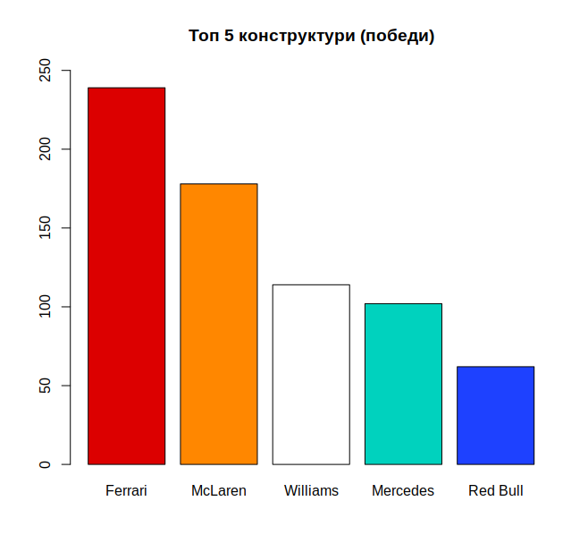
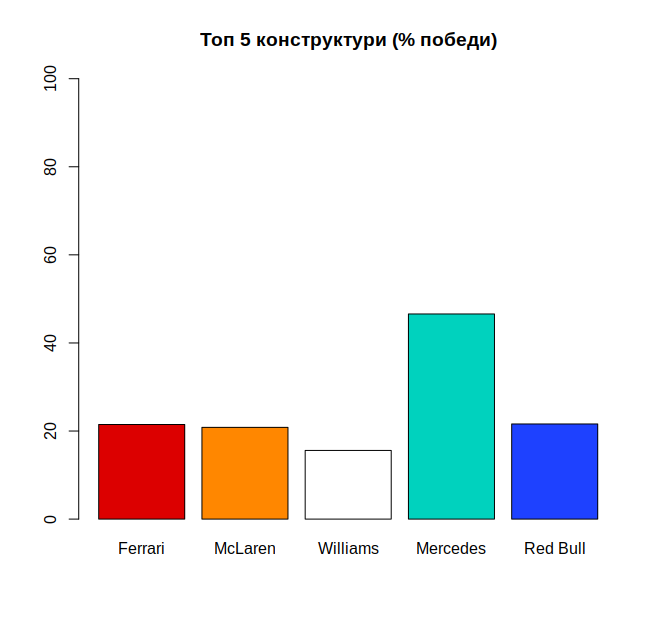
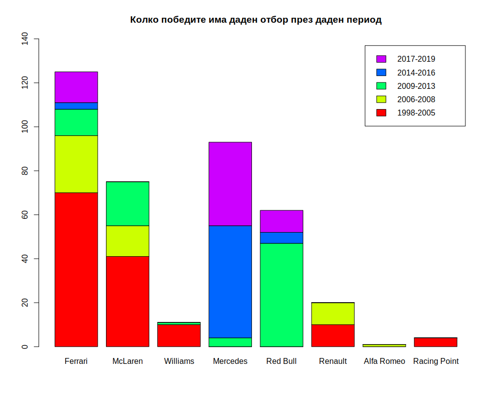
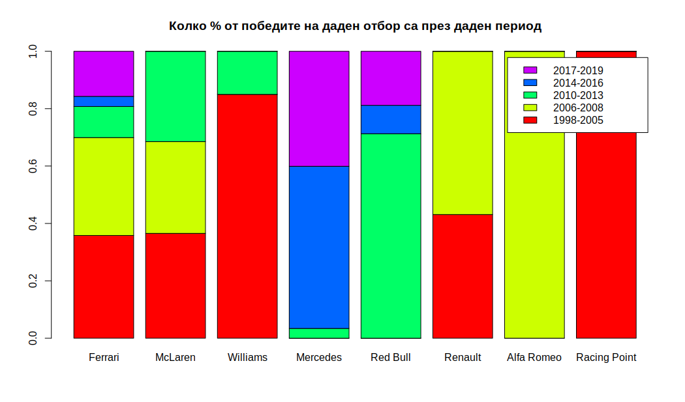
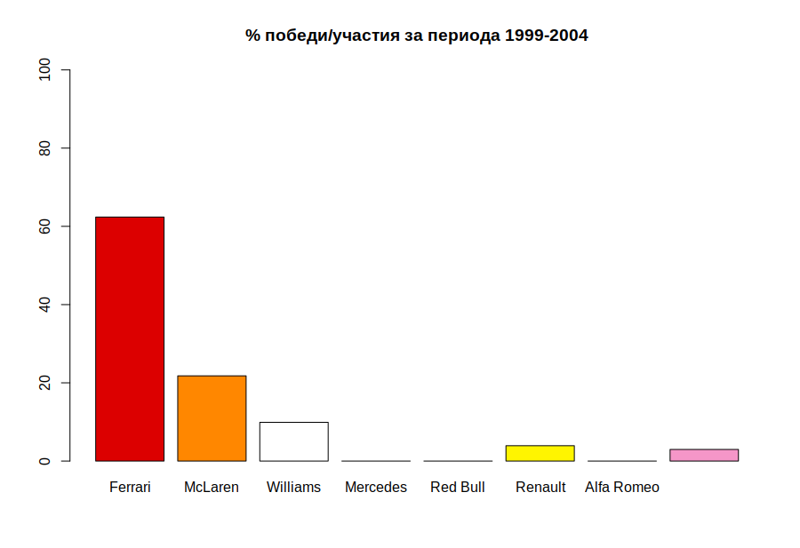
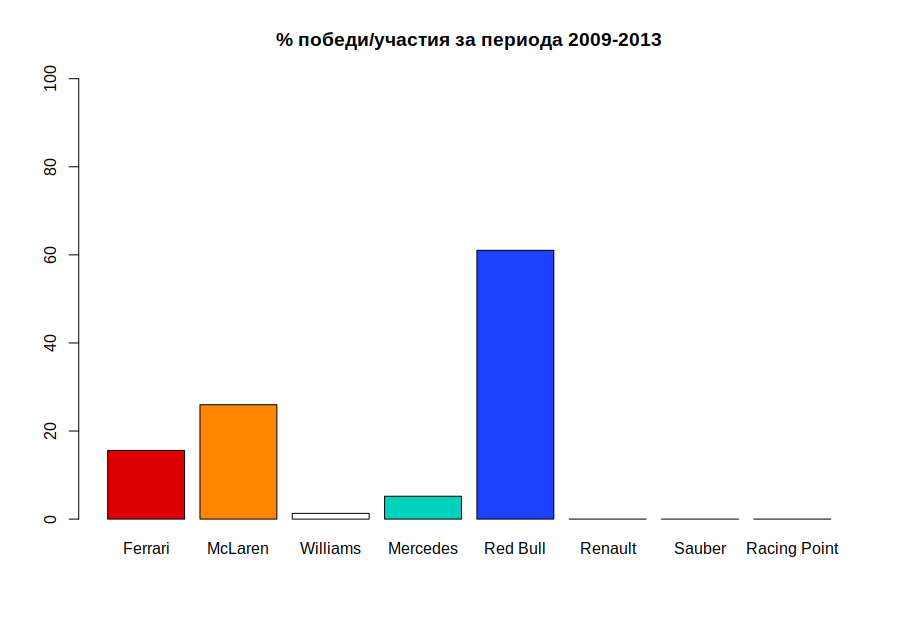
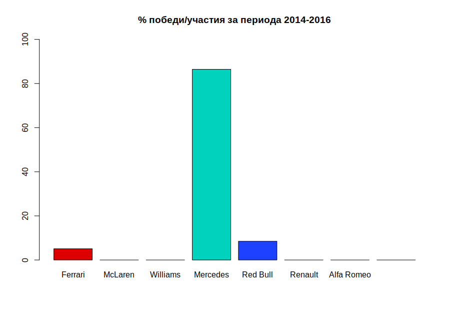
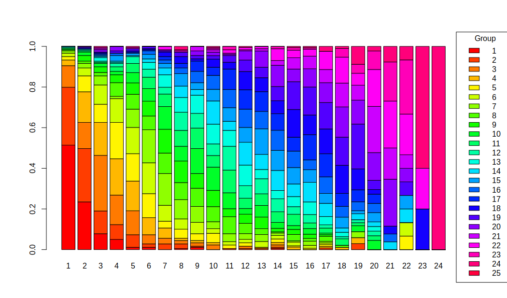
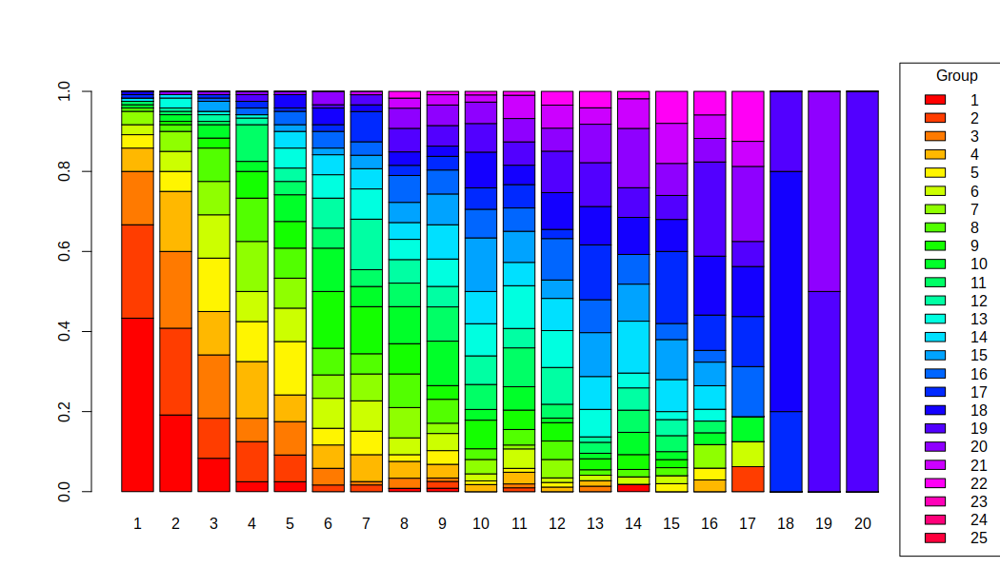
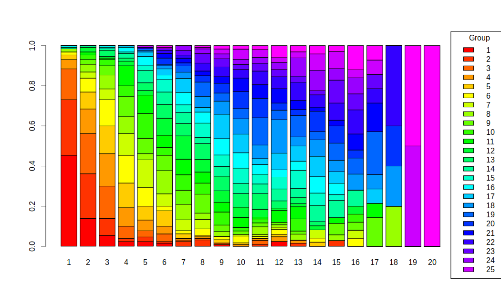

# Проект по "Статистика и емпирични методи"

## F1 data analysis

## Цел на анализа

​	Формула 1 е един доста сложен спорт - съвкупност от пилоти, инженери, мениджъри, стратези и механици се състезават един с друг с една цел - световната титла. Един интересен аспект на Формула 1 е това, че правилата за колите и състезанията се изменят с времето. Това носи елемент на непредсказуемост. Целта на моят анализ е да видим, дали можем да "предскажем" кой отбор ще бъде доминиращия, след като има промяна в правилата.

## Преглед на данните

​	Данните използвани в анализа са изтеглени от [тук](http://ergast.com/mrd/db/#csv). Събрани са данни от всички състезания във Формула 1 от 1950-та година до сега. Разделени са на отделни таблици - конструктури, пилоти, състезания. За целта на анализа ще използваме резултатите от състезанията, и от тях ще вземем следната информация - победи и подиуми. Ще ги разделим на няколко периода - предишните промени на правилата. Тези периоди са:

- 1998-2005 (Дълъг период със стабилност в правилата)
- 2006-2008 (Двигателите от V10 стават V8)
- 2009-2013 (Промени в аеродинамиката на колите през 2009, забрана за презареждане с гориво през 2010)
- 2014-2016 (Двигателите от V8 стават V6)
- 2017-2019 (Промени в аеродинамиката на колите)

Ще разгледаме победите и подиумите на 8 отбора (конструктори) - Ферари (Ferrari), МакЛарън (McLaren), Уилямс (Williams), Мерцедес (Mercedes), Ред Бул (Red Bull), Заубер (Sauber), Рейсинг Поинт (Racing Point), разпределени през различните периоди. Също така ще отговорим на въпроса - има ли връзка между позицията след квалификацията (от къде стартираме) и къде завършваме в състезанието и дали тази връзка се е променила с времето.

​	Целта, както споменах по-горе, е да се опитаме да определим кой отбор би имал най-голям шанс да доминира спорта след промените в правилата през 2021.

## Победи на отборите

​	Първото нещо, което можем да погледнем преди избора на отбор, е колко победи имат отборите до момента,  от началото на спорта (1950-та).

​	Скриптът `constructor_wins_all_time.r` се грижи за това да ни покаже графика на 5-те отбора с най-много победи. Там зареждаме данните от `results.csv` файла, избираме идентификаторите на конструкторите, които имат позиция равна на 1. От таблицата `constructors.csv` намираме името на отбора, съотвестващо на идентификатора. Съставяме таблица с резултатите, сортираме я и я чертаем с помощта на `barplot()`



​	От тази графика можем да си направим извода, че е добър вариант да изберем **Ferrari** или **McLaren** като фаворит за титлата през 2021 - все пак, те имат толкова много победи.

​	Този анализ обаче е неточен, защото никъде не се отбелязва **в колко състезания са участвали** самите отбори. Ferrari участват още от началото на шампионата (1950г.), McLaren от 1966г., Williams от 1977, Mercedes са участвали през 1954г. и 1955г., и от 2010г. отново са част в шампионата, а Red Bull участват от 2005г.

​	Нека разгледаме процентното съотношение между победи и брой състезания, в който отбора е участвал - скрипта отговарящ за това е `constructor_wins_percentage_all_time.r`



​	От тук може да си направим извода, че най-успешният отбор е **Mercedes**, който е спечелил почти половината си състезания. Освен това забелязваме, че **Ferrari**, **McLaren** и **Red Bull** имат близък процент победи. Статистиката не е на страната на **Williams**, защото имат доста нисък процент победи спрямо брой състезания. 

​	Следващият въпрос на който си струва да отговорим е, кога като период са дошли тези победи - все пак имаме отбори, които са от 50-те и 60-те години - възможно е те да са печелили тогава, а в днешни дни да не са близко до победата. С помощта на `constructor_wins.r` ще видим броя победи на всеки отборите в различните времеви периоди. Важно е да отбележим, че ще разгледаме състезанията през последните малко над 20 години (от 1998 насам).

​	Освен топ 5-те отбора, ще добавим още няколко отбора към анализа - Renault (участвали в следните периоди: 1977-1985, 2002-2011, 2016-2019), Racing Point (отбора е участвал под различни имена: от 1991г. до 2005 като Jordan, 2006 като Midland, 2007 като Spyker, 2008г. до 2018г. като Force India, 2019 като Racing Point), както и Alfa Romeo (който участва от 1993г. до 2018г. като Sauber, през от 2006г. до 2009г. отбора се е наричал BMW Sauber, а от 2019г. е Alfa Romeo)



​	От тази графика (`constructor_wins.r`) виждаме, че двата най-успешни отбора за последните 20 години са **Ferrari** и **Mercedes**. Падението на **Williams** се вижда доста силно на тази графика - от техните **114** победи, само **11** са през последните 20 години, а само **1** е през последните 10 години. 



​	От тази графика пък виждаме, какъв % от победите на всеки отбори, от кой период са дошли. Тази графика е направена, като е използване нормиране на таблица - върху всяка колона е изпъленена следната функция: Всеки елемент от коланата е разделен на сбора на елементите в колоната. Това става с помощта на следния код:

`table_percentage_wins_period_scaled <- scale(table_percentage_wins_period, center=FALSE, scale=colSums(table_percentage_wins_period))` - скрипта използва е `constructors_wins_percentage.r`	

​	Можем да направим следните изводи за всеки от отборите:

- **Sauber** и **Racing Point** са печелили състезания само в един от периодите

- **McLaren**, **Williams** и **Renault** не са печелили състезания от близо 10 години (последните победи за **Williams** и **McLaren** са през 2012, а за **Renault** - 2008)

- **Ferrari** са участвали през всички 5 разгледани периода, и са печелили състезания през всички от тях

- **Red Bull** участват в шампионата от 2005г, но техния период на доминация е **2009-2013г.**

- **Mercedes** доминират втори период, въпреки че през **2017-2019г.** печелят по-малко състезания отколкото през **2014-2016г.**

  Ако трябва да избираме кой отбор би имал най-голям шанс да спечели през 2021г. на база на предишни периоди между промяна на правилата, то **Mercedes** и **Ferrari** изглеждат фаворити.

## Сравнение на периодите на доминация

​	Забелязваме, че някои от отборите имат различни периоди на доминация: 

- **Ferrari** са имали период на голяма доминация в периода **1998-2005**, и още по-конкретно **1999-2004**
- **Red Bull** в периода **2009-2013**
- **Mercedes** е периода **2014-2016**

​	Понеже броя на състезанията през различните периоди е различен, не можем да добием много ясна представа за това колко от възможните състезания са били спечелени от даден отбор - не можем да сравним периода на доминация на **Ferrari** и **Red Bull**. Затова ще използваме скрипта `constructors_win_percentage.r` за да видим процентното съотношение на победите спрямо броя състезания през даден период. 

### Ferrari срещу Red Bull

	

​	В сравнението между Ferrari и Red Bull в техните доминантни периоди забелязваме, че двата отбора имат почти равен процент победи през сезоните (около 60%). Също така забелязваме, че McLaren и в двата периода са втория отбор по процент победи. 

### Ferrari срещу Mercedes




 	Тук виждаме ясно, че **Mercedes** изцяло доминира периода 2014-2016 година, като за тези три години, другите отбори са спечелили **само 8 от 59-те** състезания - 3 са спечелени от Ferrari, а останалите 5 от Red Bull. Докато в предишните периоди, **Ferrari** и **Red Bull** са имали някаква конкуренция, тук такава не съществува.

​	Заключение: доминацията на **Mercedes** през последните няколко години е осезаемо по-голяма от тази на **Ferrari** и на **Red Bull**

## Връзка между квалификация и състезания

​	Друг важен въпрос е има ли връзка между това от коя позиция стартираме, и на коя финишираме. Според някои фенове, в днешно време е необходимо само да видиш квалификацията, да видиш кой къде стартира, и си готов, ще знаеш резултата.

​	Затова реших да направя таблица със стартовите и финалните позиции за периода 2011-2019г. , и да използвам тестна на Pearson - Chi-squared: `chisq.test `в скрипта `corelation_between_race_qualy.r`

```R
> print(qualy_race)
    
      1  2  3  4  5  6  7  8  9 10 11 12 13 14 15 16 17 18 19 20 21 22 23 24
  1  92 42 14  9  2  2  0  1  2  0  0  0  0  1  0  0  0  0  0  0  0  0  0  0
  2  51 47 20 13 11  3  5  4  1  0  1  1  1  1  0  0  1  0  2  0  0  0  0  0
  3  19 23 49 26 21  8  5  3  3  4  0  2  0  2  0  0  0  0  0  0  0  0  0  0
  4   5 27 29 32 26 15  9  2  2  2  0  0  1  2  2  0  1  1  2  0  0  0  0  0
  5   3 14 16 32 24 21  6  8  6  8  3  3  0  3  1  1  1  0  0  0  0  1  0  0
  6   3  7 17 21 23 27 14  9 10  4  3  3  5  3  3  2  1  0  0  0  0  1  0  0
  7   2  4  8  2 16 29 28 17 14  6  7  5  6  2  1  3  1  0  2  0  0  0  0  0
  8   1  2  3 12 13 12 18 15 16 13 15  9  5  1  5  2  3  1  0  0  0  0  0  0
  9   0  5  5  7 10 13 21 19 13 14  7  8 10  3  4  3  1  0  0  0  0  0  0  0
  10  1  3  3  3  9 11 20 13 22 20 14  5 10  5  3  4  1  0  2  2  0  0  0  0
  11  1  1  1  4  8 10 11 14 18 10 20  9 10  9  9  4  3  3  1  1  0  0  0  0
  12  0  1  1  3  6  7  6 16 13 10 21 11 13 11  6  6  2  1  1  1  0  0  0  0
  13  0  0  3  1  0  6 11 13 16 17 14 18  8  7  8  9  5  2  0  1  0  0  0  0
  14  1  1  1  1  1  3  6 10  5 20  8 20 13 17 10 14  8  2  2  1  1  1  0  0
  15  0  0  1  5  2  4  4 11  6 10 12 13 22 17 13  9  6  5  1  2  0  1  0  0
  16  0  0  1  2  0  3  3  5 10 12 16 16 15 17 13  7 10  5  3  2  1  0  0  0
  17  0  0  1  0  1  1  3  4  9  7 18 17 17 14 11 18 14  6  4  2  0  0  0  0
  18  0  1  1  0  1  1  4  6  2  7  6 16 12 11 22 14 15 13  7  1  1  0  1  0
  19  0  0  0  2  2  2  1  4  3  3  6 10  9 12 22 20 16 13 15  2  0  1  0  0
  20  0  1  2  4  0  0  1  0  4  3  1  8 14 18 10 13 12 14  8  6  6  1  0  0
  21  0  0  1  0  0  0  0  0  4  2  1  1  2  4  9  9  8 11  5 10  4  1  0  0
  22  0  0  1  0  1  0  3  1  0  1  3  2  2 10  6  5 11 12  4  8  6  3  1  0
  23  0  0  0  0  0  0  0  1  0  1  3  0  0  2  2  1  0  4  3  4  5  4  0  0
  24  0  0  1  0  1  0  0  3  0  1  0  1  0  0  1  1  3  1  6  1  2  1  3  1

> chisq.test(qualy_race)

	Pearson's Chi-squared test

data:  qualy_race
X-squared = 4925.2, df = 529, p-value < 2.2e-16
```

**p-value** ни е 2.2*e^-16, или 0,000000248 -> това означава че имаме доста силна корелация на стартова и финална позиция.

**Важно е да отбележа, че тук са включени данните само за финаширалите пилоти**

​	От тук стигаме до извода, че за последните 10 години, квалификацията определя до голяма степен финалната наредба.

​	Исках да видя процентно как се отнася това, чрез графика - какъв е % шанс да завърша на определена позиция, спрямо тази на която съм стартирал. Затова отново използвах нормиране.



​	От графиката можем да забележим тенденцията, че ако стартираме от първа позиция, ако финишираме състезанието, силно вероятно е да финишираме на една от първите три позиции. Друга интересна статистика е, че ако стартираме 22-ри, имаме по-голям шанс да стигнем до точките, отколкото ако стартираме 21-ви. Най-ниската позиция от която пък е печелено състезание е 14-та.

​	Нека изпълним отново същия тест върху състезанията в периодите 1999-2005г. и 1991-1998г. 

### 1999-2005

```R
      1  2  3  4  5  6  7  8  9 10 11 12 13 14 15 16 17 18 19 20
  1  52 23 10  3  3  0  0  1  1  0  0  0  0  1  0  0  0  0  0  0
  2  28 26 12 12  8  2  2  0  2  0  1  0  0  0  0  0  1  0  0  0
  3  16 23 19  7 10  5  1  3  1  0  1  0  1  0  0  0  0  0  0  0
  4   7 18 13 17  8  7  8  5  4  2  3  1  1  0  0  1  0  0  0  0
  5   4  6 16 12 16  5  7  2  4  1  1  1  0  0  1  1  0  0  0  0
  6   3  6 13  9 10  9  9  5  5  2  5  1  1  1  1  0  1  0  0  0
  7   4  6 10 15  9  7  8  9  3  4  1  4  0  0  0  2  0  0  0  0
  8   1  2 10 13  9  8  6 10  7  3  4  4  1  1  1  0  0  0  0  0
  9   0  1  3  8  8 17 14  9  4  8  5  4  2  2  1  0  0  0  0  0
  10  1  2  4  3  8 13  6 11 13  3  6  1  1  3  1  1  1  0  0  0
  11  1  1  1 11  4  6  5  7 10  7 10  3  2  3  2  1  0  0  0  0
  12  0  1  2  2  4  9 15  7  6  8  5  8  1  3  2  0  0  0  0  0
  13  0  3  1  1  6  7  9  6  8  9 11  8  5  2  1  1  0  0  0  0
  14  1  1  0  0  5  6  6  5 10  9  6  7  6  7  4  2  0  0  0  0
  15  0  0  3  0  2  2  4  6  9 15  8  4  8  5  5  2  0  0  0  0
  16  0  0  1  2  4  5  4  8  7  8  6  9  6  4  2  1  2  0  0  0
  17  1  0  1  2  1  2  9  3  4  6  6  2 10  0  9  3  2  1  0  0
  18  1  0  0  0  4  5  2  4  3 10  5  8  7  5  4  5  2  3  0  0
  19  0  0  0  2  0  1  3  7  6  8  6  9  8  4  3  8  1  1  1  1
  20  0  1  1  1  1  4  0  6  6  6  6  5  7  8  4  2  3  0  1  0
  21  0  0  0  0  0  0  1  3  3  2  6  5  3  4  5  2  1  0  0  0
  22  0  0  0  0  0  0  0  2  1  1  1  3  3  1  4  2  2  0  0  0

> chisq.test(qualy_race)

	Pearson's Chi-squared test

data:  qualy_race
X-squared = 1685.9, df = 399, p-value < 2.2e-16

```



​	Тук забелязваме, че пилотите стартирали от първа позиция, по-рядко са завършвали в топ 3 отколкото през периода 2011-2019г. Също така забелязваме, че 11-та стартова позиция е носела по-добри резултати отколкото 10-та. 

### 1991-1998

```R
> print(qualy_race)
    
      1  2  3  4  5  6  7  8  9 10 11 12 13 14 15 16 17 18 19 20
  1  59 18  7  3  3  2  0  0  1  0  0  2  0  0  0  0  0  0  0  0
  2  36 29 11  2  3  1  3  4  0  0  1  0  1  0  1  0  0  0  0  0
  3  20 26 21  8  4  5  1  1  1  0  2  0  0  0  0  0  0  0  0  0
  4   6 16 21 12  7  5  1  1  0  1  1  2  1  0  0  0  0  0  0  0
  5   3 11 18 16  9 10  3  1  2  1  0  1  0  1  0  0  0  0  0  0
  6   2  9 17 18 12  3  2  4  2  4  1  2  0  1  0  1  0  0  0  0
  7   0  4  7 14 18  8  7  6  0  1  1  1  0  2  0  1  0  0  0  0
  8   2  5  9 11  4 15 10  4  3  0  4  1  2  0  1  0  0  1  0  0
  9   0  3  6 13 10 10  9 12  4  2  2  1  1  0  2  1  2  0  0  0
  10  0  3  4  7 16  5 10  7  8  2  2  0  4  0  0  1  0  0  0  0
  11  0  2  1 13 12  8 10  7  6  6  1  5  4  0  1  0  1  0  0  0
  12  0  3  1  3  3 11 15  8  7  6  4  1  1  1  0  1  0  0  0  0
  13  0  0  4  2  5  9  8 10  9  8  8  3  2  1  0  0  0  0  0  0
  14  1  1  1  3  8  8  7  4  6  6  5  5  3  4  3  2  0  0  0  0
  15  0  0  1  1  3  8  5  9  7  9  5  5  6  3  1  0  0  0  0  0
  16  1  0  1  3  6  3  8  7 10  9  5  3  3  4  2  0  0  0  0  0
  17  0  0  0  1  3  4  9  3 15 11  3  7  5  5  2  0  1  0  0  0
  18  0  0  0  0  1  2  4  7  8  9  7 14  3  4  2  2  1  1  0  0
  19  0  0  0  0  1  1  4  9  5  6 14  4  7  2  3  2  3  0  0  0
  20  0  0  0  0  0  4  2  4  6 10 10  3  2  5  3  1  0  1  0  0
  21  0  0  0  0  0  3  3  3  4  8  7  6  3  1  1  2  2  0  0  0
  22  0  0  0  0  1  2  2  5  6  5  7  5  6  3  3  3  1  2  0  0
  23  0  0  0  0  0  1  3  6  5  3  4  3  2  1  4  2  1  0  0  0
  24  0  0  0  0  0  0  3  3  3  3  3  3  6  5  2  2  0  0  0  0
  25  0  0  0  0  1  1  0  1  3  6  4  2  2  4  3  1  1  0  1  0
  26  0  0  0  0  0  1  0  1  2  2  2  5  2  2  1  3  1  0  1  1
  27  0  0  0  0  0  0  0  0  0  0  0  0  0  0  0  0  0  0  0  0
  28  0  0  0  0  0  0  0  0  0  0  0  0  0  0  0  0  0  0  0  0
```



​	През периода 1991-1998г. обаче, пилота стартирал от първа позиция е финиширал в топ 3 доста често, подобно на 2011-2019г. Разликата обаче, е при стартиралия на 3-та позиция - неговия шанс да остане в топ 3 е около 30%, докато през 2011-2019г. е около 50%.

​	**Извод: Квалификацията е важна. Съществуват изключения, но те са малки на брой.**

## Кой отбор да изберем в крайна сметка ?

​	Ако трябваше да посочим един отбор, който да е фаворит за спечелването на титлата през 2021, то статистиката ни казва няколко неща:

- **Mercedes** доминират в два периода (2014-2016 и 2017-2019), макар и сегашната доминация да е по-малка в сравнение с 2014-2016, изглежда че **Mercedes** ще продължат да бъдат фактор в спорта (стига да не го напуснат)
- **Ferrari** винаги имат победи, независимо от периода - отбора с най-много победи и най-много състезания никога не е лош вариант.
- **Red Bull** също имат победи, макар и при тях да не са толкова добре разпределени във времето - периода на доминацията им обаче е сравнително по-лош от този на **Mercedes**
- **McLaren** са черния кон в това състезание - макар и да не са печелили в скоро време, те също имат победи в много от различните периоди.